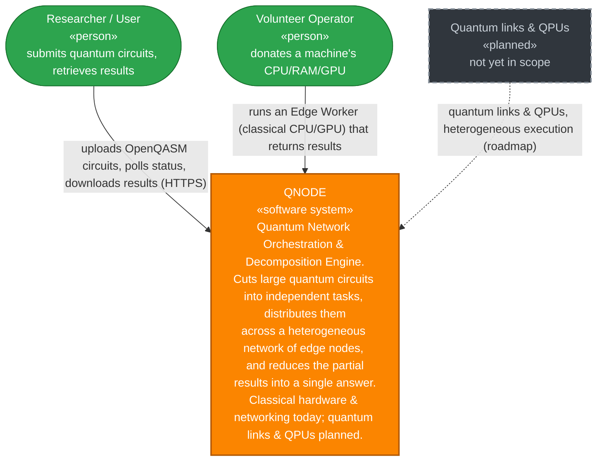

  

  ### Trustworthy Quantum DevOps for Secure Software and Hardware Engineering
  
  
  

---

Welcome to the official GitHub organization for **SecQDevOps** (Secure Quantum Development and Operations). 

We are an EU-funded research and engineering consortium dedicated to building a secure, continuous DevOps pipeline for quantum software and hardware. As the quantum computing landscape accelerates, we are bridging the critical gap between rapid quantum development and robust, quantum-specific security infrastructures.

## 🚀 Coming Soon: QNODE (Quantum Network Orchestration & Decomposition Engine)

Currently in active development, **QNODE** is our flagship distributed quantum-circuit simulation network. 

Designed for massive scalability, QNODE leverages advanced tensor network slicing to decompose complex quantum circuits into independent tasks. This allows for highly parallelized edge execution without the overhead of inter-node communication. 

### Heterogeneous by design – the IoQT execution core

QNODE sits at the core of the **IoQT (Internet of Quantum Things)** network. Its architecture treats the two building blocks of a distributed simulator. The **network links** between nodes and the **compute nodes** themselves as pluggable, so a single system can run **classical and quantum resources side by side**:

* **Compute nodes** contract tensor-network slices on classical CPU/GPU today. The same hardware-agnostic node interface can accept a **Quantum Processing Unit (QPU)**.
* **Network links** use classical networking today. The same topology can run over **quantum network links**.

Today the platform runs entirely on **classical hardware and classical networking**. Quantum links and QPUs are **not yet in scope**, but the design keeps them a drop-in evolution as the system matures.

### System Architecture

*Solid = runs today (classical). Dashed = planned quantum networking and Quantum Processing Units, not yet in scope.*

**Open Source Commitment:**
The entire QNODE platform is designed to be **100% open-source**. We recently reached our MVP milestone and are currently optimizing the components and conducting a rigorous Supply Chain License review. 

Once these audits are complete, the repositories will be made public here. Watch this space!

## 📦 Repository Map

| Repository                                                                             | Language/Tech | Role                                                                                        |
|----------------------------------------------------------------------------------------|---------------|---------------------------------------------------------------------------------------------|
| [qnode-backend-gateway](https://github.com/SecQDevOps/qnode-backend-gateway)           | Go            | HTTP API gateway; entry point for circuit submission and result retrieval                   |
| [qnode-backend-orchestrator](https://github.com/SecQDevOps/qnode-backend-orchestrator) | Python        | Temporal-based workflow orchestration; manages circuit decomposition and task distribution  |
| [qnode-backend-slicer](https://github.com/SecQDevOps/qnode-backend-slicer)             | Python        | Tensor network slicing; decomposes quantum circuits into independent contractions           |
| [qnode-backend-reducer](https://github.com/SecQDevOps/qnode-backend-reducer)           | Rust          | High-performance result aggregation; combines partial results from edge workers             |
| [qnode-edge-worker](https://github.com/SecQDevOps/qnode-edge-worker)                   | Python        | Edge compute node; pulls tasks and contracts tensor slices on classical CPU/GPU (QPU-ready) |
| [qnode-tooling-frontend](https://github.com/SecQDevOps/qnode-tooling-frontend)         | TypeScript    | Web UI for researchers; submit circuits, monitor jobs, retrieve results                     |
| [qnode-at-home](https://github.com/SecQDevOps/qnode-at-home)                           | Docker/K8s    | Deployments                                                                                 |

## 🔬 Our Core Pillars

* **Security by Design:** Automated security assessments and real-time vulnerability detection for quantum algorithms.
* **Quantum Engineering:** Hardware-aware compilers and high-level programming workflows powered by tools like Eclipse Qrisp.
* **Distributed Quantum Execution:** Orchestrating edge infrastructure to securely distribute and compute massive quantum tasks via QNODE.

---

*This work has received funding from the European Union under the Horizon Europe Research and Innovation Program (Grant Agreement No. 101225776).*